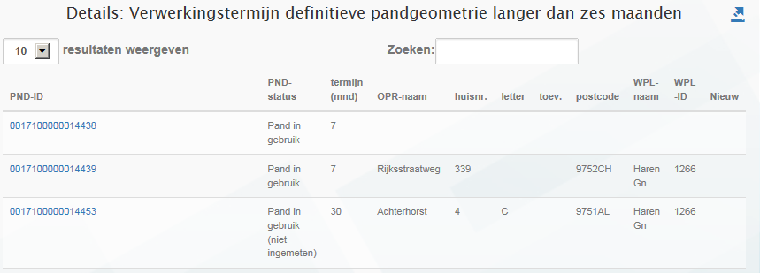

# Verwerkingstermijn definitieve pandgeometrie langer dan zes maanden (VDP)

## Wat wordt er gerapporteerd?

De wet BAG schrijft voor dat de definitieve pandgeometrie binnen zes maanden in de BAG geregisteerd wordt. Deze rapportage geeft de panden weer waarvan de definitieve geometrie te laat is geregistreerd. Er worden in twee situaties resultaten van panden gerapporteerd:

- Panden waarvan de geometrie in de afgelopen periode te laat beschikbaar is gekomen. Dit zijn panden die in de periode sinds de vorige rapportage voor het eerst de status `Pand in gebruik` hebben gekregen, die langer dan zes maanden als voorgaande status de status `Pand in gebruik (niet ingemeten)` hebben gehad. Hierbij worden de tijdvakken van aaneengesloten voorkomens met deze status bij elkaar opgeteld. Deze panden zijn in de rapportage te herkennen aan de status `Pand in gebruik`.
- Panden met de status `Pand in gebruik (niet ingemeten)` waarvan de definitieve geometrie al langer dan zes maanden niet beschikbaar is gekomen. Hierbij worden de tijdvakken van aaneengesloten voorkomens met deze status bij elkaar op geteld.

Om te voorkomen dat panden worden gerapporteerd die verbouwd worden, rapporteren we geen panden die eerder al een status `Pand in gebruik` hebben gehad.

## Hoe kan het resultaat gecorrigeerd worden?

De resultaten kunnen voor de panden waarvan de geometrie nog niet is verwerkt gecorrigeerd worden door de definitieve geometrie alsnog in de BAG op te nemen. Omdat de geometrie in dat geval wel te laat is verwerkt, zal het pand nog één keer worden gerapporteerd in de volgende rapportage. Daarna zal het pand dan niet meer voorkomen. Panden waarvan de definitieve geometrie blijvend niet wordt verwerkt, zullen steeds opnieuw worden getoond in de rapportage.

## Hoe kan het resultaat worden voorkomen?

U kunt dit voorkomen door de definitieve geometrie tijdig in de BAG te registreren. Het kan zijn dat het hiervoor nodig is dat binnengemeentelijke processen die zich buiten de BAG afspelen geoptimaliseerd moeten worden.
