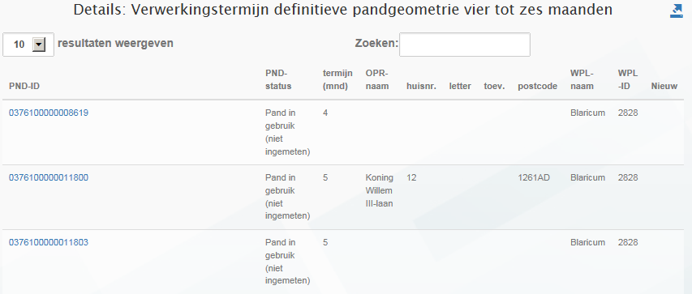

# Verwerkingstermijn definitieve pandgeometrie vier tot zes maanden (VPK)

## Wat wordt er gerapporteerd?

De wet BAG schrijft voor dat de definitieve pandgeometrie binnen zes maanden in de BAG geregistreerd wordt. Deze rapportage geeft aan van welke panden de _voorlopige_ geometrie vier tot zes maanden in de BAG geregistreerd staat. Hierbij worden de tijdvakken van aaneengesloten voorkomens met deze status bij elkaar op geteld. De verwerkingstermijn van deze panden dreigt te verlopen. Deze rapportage stelt de gemeente in staat actie te ondernemen zodat de definitieve pandgeometrie alsnog tijdig verwerkt kan worden.

Om te voorkomen dat panden worden gerapporteerd die verbouwd worden, rapporteren we geen panden die eerder al een status `Pand in gebruik` hebben gehad.

## Hoe kan het resultaat gecorrigeerd worden?

Deze rapportage geeft situaties weer die nog binnen de wettelijke termijn vallen. Er is daarom nog geen sprake van objecten die gecorrigeerd moeten worden.

## Hoe kan een resultaat worden voorkomen?
Door de definitieve geometrie van deze panden tijdig in de BAG te verwerken kunt u voorkomen dat deze panden uiteindelijk gerapporteerd worden als panden waarvan de definitieve pandgeometrie te laat is verwerkt.
