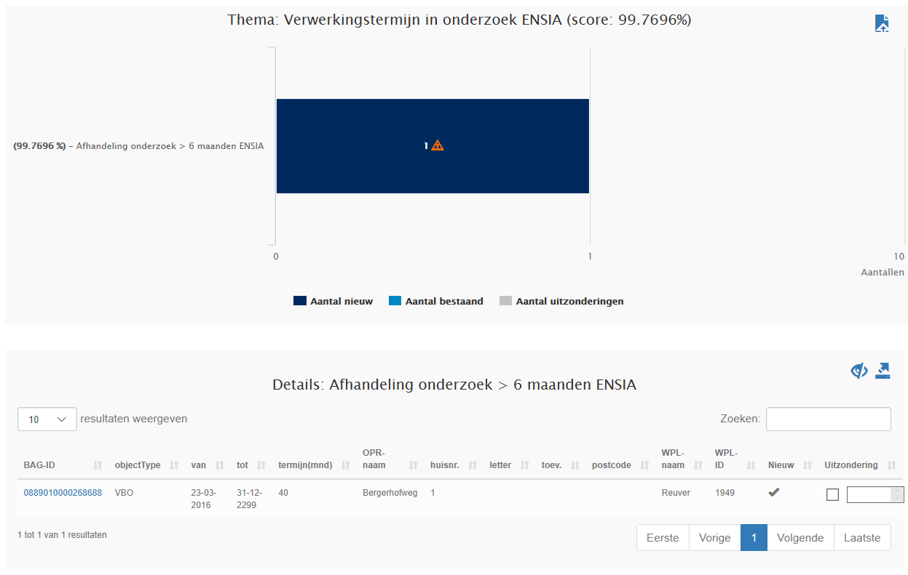

# Verwerkingstermijn in onderzoek ENSIA (VOE)

## Wat wordt er gerapporteerd?

De wet BAG schrijft voor dat een onderzoek naar de juistheid van een bepaald gegeven binnen zes maanden afgerond moet zijn. Deze rapportage geeft weer in hoeveel procent van de gevallen onderzoeken tijdig worden afgehandeld. Dit percentage kan worden gebruikt voor de beantwoording van de vraag hierover in de ENSIA vragenlijst.

Het aantal resultaten in de rapportage is het totaal van:
1. Onderzoeken die nog niet zijn afgerond terwijl de termijn al wel is verstreken (open en te laat).
2. Onderzoeken die in de rapportageperiode zijn afgerond waarvan de afhandeling meer dan zes maanden heeft geduurd.
Bij het bepalen van de termijn worden de tijdvakken van aaneengesloten voorkomens met de indicatie 'in onderzoek' bij elkaar opgeteld.

Dit totaal aantal resultaten wordt afgezet tegen het totaal van:
- Onderzoeken die nog niet zijn afgerond terwijl de termijn al wel is verstreken (‘Open en te laat’).  Dit is nummer 1 van de hierboven beschreven resultaten. 
- Onderzoeken die in de rapportageperiode zijn afgerond waarvan de afhandeling langer dan zes maanden heeft geduurd.  Dit is nummer 2 van de hierboven beschreven resultaten. 
- Onderzoeken die in de rapportageperiode zijn afgerond waarvan de afhandeling korter dan zes maanden heeft geduurd.  Dit is nummer 2 van de hierboven beschreven resultaten maar dan met een termijn korter dan zes maanden. 

Onderzoeken die voorafgaand aan de rapportageperiode zijn afgerond of waarvan de verwerkingstermijn nog niet is verlopen, maken geen onderdeel uit van de rapportage.

Voorbeeld: 

|Gemeente X |01-11-2019 | 
|:--- |:--- |
| Totaal aantal | 15 | 
| Op tijd verwerkt | 9 | 
| Te laat verwerkt | 4 | 
| Open en te laat | 2 | 
| Percentage op tijd | 60% | 

Voor Gemeente X zijn tussen 1 oktober en 1 november 15 onderzoeken relevant voor de rapportage. Er zijn 9 onderzoeken binnen de termijn verwerkt. Bij 4 afgeronde onderzoeken is de verwerkingstermijn niet gehaald en er zijn 2 onderzoeken nog niet afgerond terwijl de termijn al wel is verstreken. Dit betekent dat 9 van de 15 onderzoeken tijdig zijn afgehandeld. Dit leidt tot een percentage van 60% (9/15*100). De interventiewaarde van 98% wordt in dit geval niet gehaald.

## Hoe kan het resultaat gecorrigeerd worden?
Voor objecten waarvan het onderzoek nog niet is afgerond, kunnen de resultaten gecorrigeerd worden door het onderzoek alsnog af te ronden. Omdat het onderzoek in dat geval wel te laat is afgerond, zal het object nog één keer worden gerapporteerd in de volgende rapportage. Daarna zal het object niet meer voorkomen in de rapportage. Objecten waarvan het onderzoek blijvend niet wordt afgerond, zullen steeds opnieuw worden getoond in de rapportage.

## Hoe kan een resultaat worden voorkomen?
Het resultaat kan voorkomen worden door onderzoeken binnen zes maanden af te ronden. Het kan zijn dat het hiervoor nodig is dat binnengemeentelijke processen die zich buiten de BAG afspelen geoptimaliseerd moeten worden. In de rapportage [Afhandeling gegevens in onderzoek vier tot zes maanden (VIK)]({{-site.baseurl-}}/kwaliteitsrapporten/afhandeling-gegevens-in-onderzoek-vier-tot-zes-maanden) kunt u terugzien bij welke objecten overschrijding van de termijn dreigt. 
