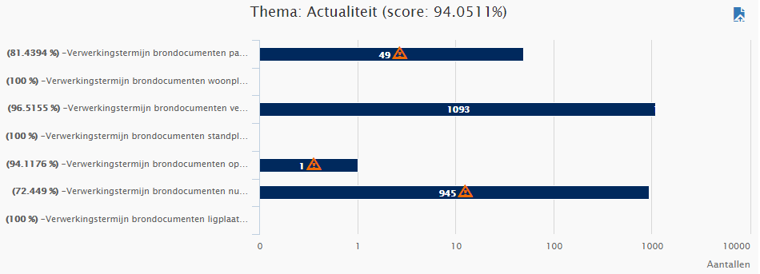

# Actualiteit

Het thema Actualiteit geeft inzicht in de actualiteit van de gegevens in de BAG. De Wet BAG schrijft voor dat brondocumenten binnen vijf werkdagen verwerkt moeten zijn in de LV BAG. Deze vijf werkdagen bestaan uit vier werkdagen voor het verwerken in de registratie van de bronhouder en één werkdag voor het verwerken van de gegevens in de LV BAG. In dit thema is per rapportage vermeld welke objecten te laat zijn gemuteerd in de periode sinds de vorige rapportage. Het scorepercentage van het thema is gebaseerd op het totaal aantal brondocumenten per rapportage dat te laat verwerkt is, ten opzichte van het totaal aantal brondocumenten dat is verwerkt (het totaal aantal mutaties van die periode, te vinden op de pagina 'Aantallen' in het Kwaliteitsdashboard).

