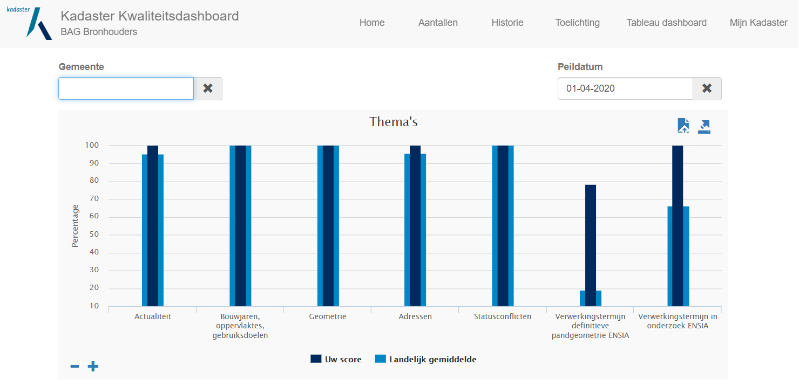
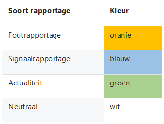
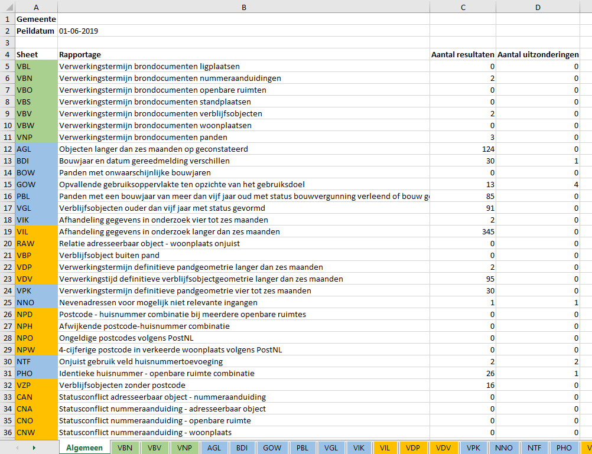
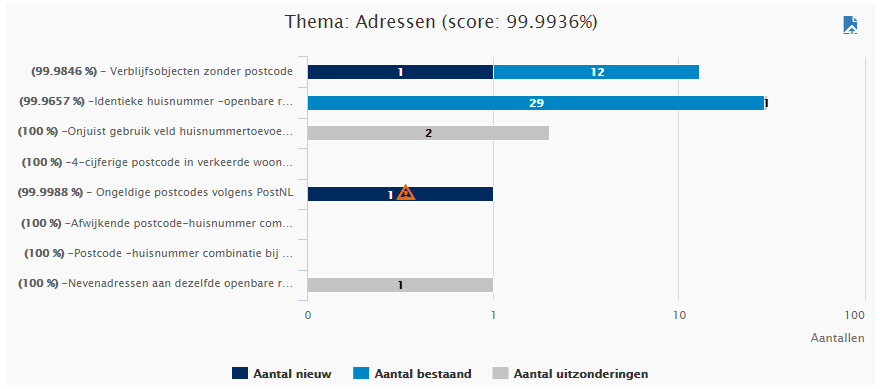
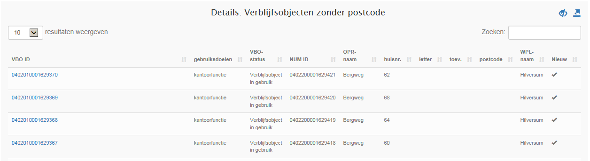
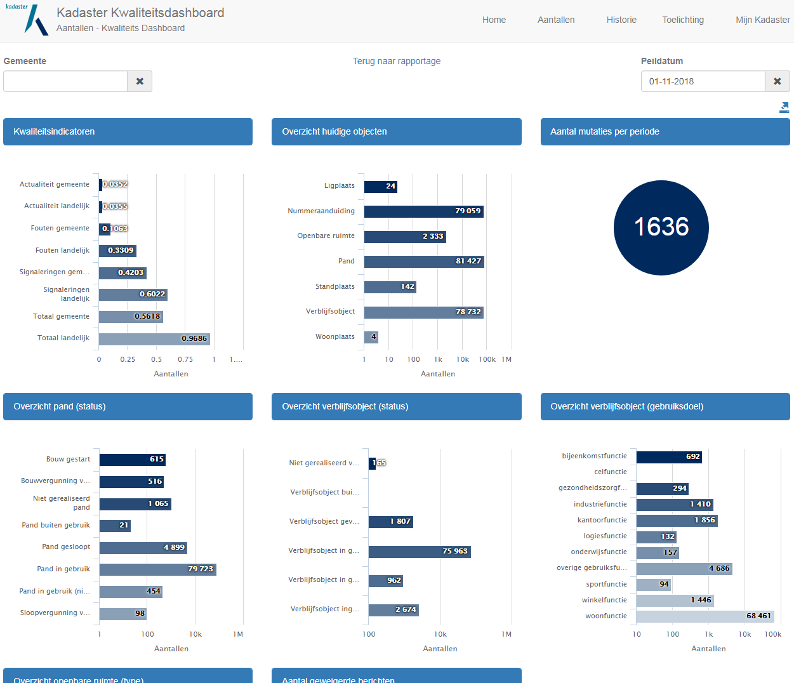
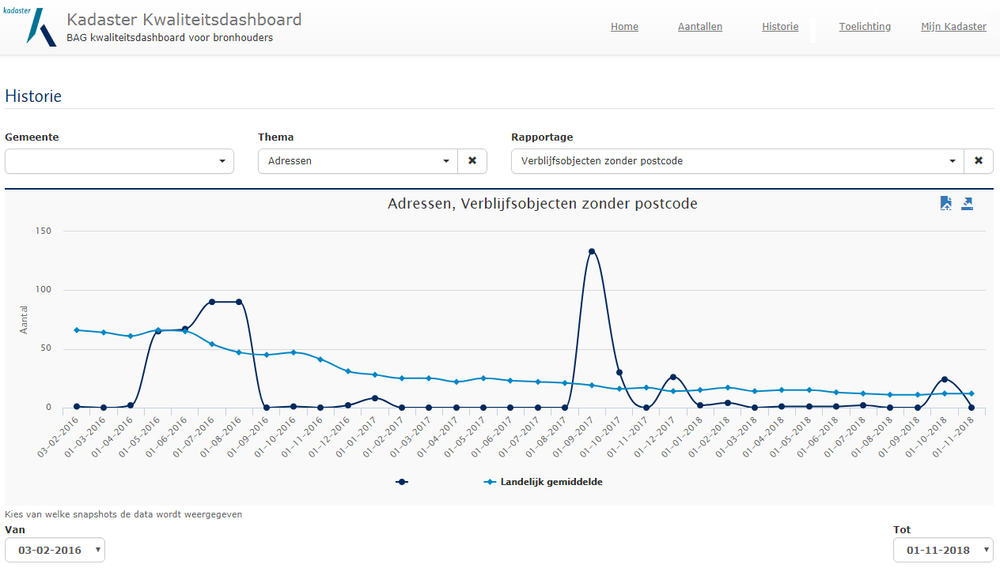

# Toelichting bij het kwaliteitsdashboard voor bronhouders

De kwaliteit van de BAG is een belangrijke voorwaarde voor het gebruik ervan. Daarom heeft het Kadaster in opdracht van het BAG BAO een kwaliteitsdashboard ontwikkeld. In dit document leggen wij uit hoe het kwaliteitsdashboard werkt en welke rapportages in het kwaliteitsdashboard zijn opgenomen.
De gegevens in het kwaliteitsdashboard worden maandelijks geactualiseerd, zodat u maandelijks kunt controleren of de kwaliteit van uw BAG registratie op orde is.

# Werking BAG Kwaliteitsdashboard

Het BAG Kwaliteitsdashboard is via [Mijn Kadaster](https://mijn.kadaster.nl){:target="blank"} te benaderen en geeft inzicht in de kwaliteit van de gegevens van de BAG-registratie per gemeente. Binnen het BAG Kwaliteitsdashboard wordt toegang verleend tot de gegevens van de gemeente waarvan de gebruiker is ingelogd via Mijn Kadaster.

Via het navigatiemenu bovenaan wordt toegang verleend tot verschillende pagina's:

- Home: de startpagina van het BAG Kwaliteitsdashboard met de kwaliteitsrapportages;
- Aantallen: toont een overzicht van de aantallen objecten van de eigen registratie van de BAG zoals bekend in de Landelijke Voorziening;
- Historie: hierin is de ontwikkeling van de kwaliteit van de eigen gemeente per thema (bijvoorbeeld thema Adressen) dan wel per individuele detailrapportage binnen een bepaald thema te volgen;
- Toelichting: hiermee navigeert u naar de [pagina BAG Kwaliteitszorg](https://zakelijk.kadaster.nl/bag-kwaliteitszorg){:target="blank"} waar u een link vindt naar de toelichting die u nu voor u heeft;
- Tableau dashboard: hiermee navigeert u naar het [Dashboard Terugmeldingen](https://public.tableau.com/profile/bag.kadaster#!/vizhome/Terugmeldingen6maanden/DashboardTerugmeldingen){:target="blank"} op Tableau. In dit dashboard worden de gegevens uit het terugmeldsysteem op verschillende wijzen gevisualiseerd. U kunt de terugmeldgegevens zowel voor één als voor meerdere gemeenten bekijken. Het Dashboard Terugmeldingen wordt wekelijks geactualiseerd;
- Mijn Kadaster: hiermee gaat u terug naar [Mijn Kadaster](https://mijn.kadaster.nl/){:target="blank"}.

## Fouten en signaleringen

In het BAG Kwaliteitsdashboard wordt gebruik gemaakt van verschillende rapportages binnen 7 thema's. Deze rapportages zijn te onderscheiden in zogenaamde 'foutrapportages' en 'signaleringsrapportages'.

### Foutrapportages

'Foutrapportages' bevatten resultaten in de LV-BAG die volgens de wet of de richtlijnen echt fout zijn. Deze fouten dienen opgelost te worden. De resultaten in de rapportages dienen feitelijk op 0 te staan. De mogelijkheid om een uitzonderingsmarkering te plaatsen voor deze rapportages wordt ook niet ondersteund binnen het Kwaliteitsdashboard.

De volgende tabel bevat een opsomming van de 'Foutrapportages' die in het Kwaliteitsdashboard voorkomen.

Fout | Omschrijving |
|:---:|:---|
VBL | Verwerkingstermijn brondocumenten ligplaatsen |
VBN | Verwerkingstermijn brondocumenten nummeraanduidingen |
VBO | Verwerkingstermijn brondocumenten openbare ruimten |
VBS | Verwerkingstermijn brondocumenten standplaatsen |
VBV | Verwerkingstermijn brondocumenten verblijfsobjecten |
VBW | Verwerkingstermijn brondocumenten woonplaatsen |
VNP | Verwerkingstermijn brondocumenten panden |
VIL | Afhandeling gegevens in onderzoek langer dan zes maanden |
RAW | Relatie adresseerbaar object - woonplaats onjuist |
VBP | Verblijfsobject buiten pand |
VDP | Verwerkingstermijn definitieve pandgeometrie langer dan zes maanden |
VDV | Verwerkingstijd definitieve verblijfsobjectgeometrie langer dan zes maanden |
NPD | Postcode - huisnummer combinatie bij meerdere openbare ruimtes |
NPH | Afwijkende postcode-huisnummer combinatie |
NPO | Ongeldige postcodes volgens PostNL |
NPW | 4-cijferige postcode in verkeerde woonplaats volgens PostNL |
VZP | Verblijfsobjecten zonder postcode |
CAN | Statusconflict adresseerbaar object - nummeraanduiding |
CNA | Statusconflict nummeraanduiding - adresseerbaar object |
CNO | Statusconflict nummeraanduiding - openbare ruimte |
CNW | Statusconflict nummeraanduiding - woonplaats |
COW | Statusconflict openbare ruimte - woonplaats |
CVP | Statusconflict verblijfsobject - pand |
NZA | Nummeraanduidingen zonder adresseerbaar object |
VPE | Verwerkingstermijn definitieve pandgeometrie ENSIA
VOE | Verwerkingstermijn in onderzoek ENSIA

### Signaleringsrapportages

'Signaleringsrapportages' bevatten 'opvallende resultaten' die expliciet onder de aandacht worden gebracht om daar een passende actie op te ondernemen. Dit zijn weliswaar geen fouten in de zin dat daar regelgeving over bestaat, maar het is goed dat regelmatig monitoring plaats vindt zodat afnemers/gebruikers van de BAG niet onnodig hinder ondervinden van situaties die feitelijk anders zijn.

In de volgende tabel is per rapportage in het Kwaliteitsdashboard aangegeven of deze signaleringen bevat.

Signalering | Omschrijving |
|:---:|:---|
AGL | Objecten langer dan zes maanden op geconstateerd |
BDI | Bouwjaar en datum gereedmelding verschillen |
BOW | Panden met onwaarschijnlijke bouwjaren |
GOW | Opvallende gebruiksoppervlakte ten opzichte van het gebruiksdoel |
PBL | Panden met een bouwjaar van meer dan vijf jaar oud met status bouwvergunning verleend of bouw gestart |
VGL | Verblijfsobjecten ouder dan vijf jaar met status gevormd |
VIK | Afhandeling gegevens in onderzoek vier tot zes maanden |
VPK | Verwerkingstermijn definitieve pandgeometrie vier tot zes maanden |
NTF | Onjuist gebruik veld huisnummertoevoeging |
PHO | Identieke huisnummer - openbare ruimte combinatie |
NNO | Nevenadressen voor mogelijk niet relevante ingangen |

## Pagina 'Home'

De pagina 'Home' is de startpagina van het Kwaliteitsdashboard en toont de scores van de verschillende kwaliteitsrapportages.

### Thema's

Het dashboard is opgedeeld in verschillende thema’s:
- Actualiteit
- Bouwjaren, oppervlaktes, gebruiksdoelen
- Geometrie
- Adressen
- Statusconflicten
- Verwerkingstermijn definitieve pandgeometrie ENSIA
- Verwerkingstermijn in onderzoek ENSIA

_Afbeelding 1: Schermvoorbeeld 'Thema's'_

#### Peildatum
U kunt door het selecteren van een peildatum zelf aangeven van welke datum u de gegevens wilt zien. Standaard worden de gegevens getoond van de laatst beschikbare peildatum. Tenzij anders staat vermeld in de rapportage, worden alleen huidige objecten gerapporteerd.

#### Percentages

Per thema kunt u zien wat het percentage van de kwaliteit is van de registratie van uw gemeente (donkerblauwe kolom) ten opzichte van het landelijke gemiddelde (lichtblauwe kolom) door de muisaanwijzer over de desbetreffende kolom te bewegen.

De y-as van de themakolom kan verkleind (-) en vergroot (+) worden met een waarde tussen 0% en 99.5%.

Aan de hand van de resultaten van de thema's wordt het standaard getoonde percentage van de y-as ingesteld volgens de volgende criteria:
-	Indien het minimum >= 95%, wordt het minimale percentage van de y-as: 95%
-	Indien het minimum tussen 70% en 95% ligt, wordt het minimale percentage van de y-as: de minimale waarde naar beneden afgerond op vijftallen
- Indien het minimum tussen 0% en 70% ligt, wordt het minimale percentage van de y-as: de minimale waarde naar beneden afgerond op tientallen

De thema's tonen het gemiddelde van de percentages van de rapportages die binnen een thema zijn opgenomen.
_Uitzondering hierop is de berekening van het percentage van het thema Actualiteit, dit percentage wordt berekend door alle te laat verwerkte brondocumenten af te zetten tegen het totaal aantal mutaties van de geselecteerde peildatum. Hiermee kan dit percentage ook worden gebruikt om de vraag hierover in de ENSIA vragenlijst te beantwoorden._

Voor de individuele rapportages binnen een thema geldt dat het percentage wordt berekend door de geconstateerde resultaten af te zetten tegen het aantal (voor die rapportage relevante) objecten in de registratie:

_Bijvoorbeeld:_

- voor de rapportage 'Panden met onwaarschijnlijke bouwjaren' worden de geconstateerde resultaten afgezet tegen het **totaal aantal panden**.
- voor de rapportage 'Verblijfsobject buiten pand' worden de geconstateerde resultaten afgezet tegen het **totaal aantal verblijfsobjecten**.

#### Download grafiek thema's
Met de -knop kunt u de getoonde grafiek in pdf downloaden.

#### Download resultaten thema's
Met de -knop kunt u de resultaten van alle thema's en de detailresultaten van onderliggende rapportages van de geselecteerde peildatum downloaden in excel.

De kleuren geven weer welke soort rapportage het betreft:

_Afbeelding 2: Gebruik kleuren bij download resultaten_

### Weergeven van thema

Door te klikken op de scorekolom van een thema krijgt u een overzicht met kwaliteitsrapportages binnen het geselecteerde thema en hoeveel resultaten deze hebben opgeleverd. In het label van elke kwaliteitsrapportage staat het scorepercentage en de titel van de kwaliteitsrapportage. Indien de titel is afgekort, kan de gehele titel zichtbaar worden gemaakt door deze aan te wijzen.

_Afbeelding 3: Schermvoorbeeld 'Thema: Adressen'_

#### Bestaande resultaten

De bestaande resultaten van een rapportage bij de getoonde peildatum worden in het lichtblauw gekleurde gedeelte van de balk weergegeven. Hiermee kunt u zien hoeveel resultaten in een vorige peildatum ook al bekend zijn.

#### Nieuwe resultaten

De nieuwe resultaten van de getoonde peildatum worden in het donkerblauw gekleurde gedeelte van de balk weergegeven. Hiermee kunt u zien hoeveel resultaten er nieuw zijn bijgekomen ten opzichte van de bestaande resultaten van de vorige peildatum(s).

Het is mogelijk dat er een oranje waarschuwingsteken  verschijnt bij het aantal nieuwe resultaten in de balk. Dit is het geval als er in de voorgaande peildatum helemaal geen resultaten waren bij een rapportage en bij de huidige peildatum wel. Hiermee wordt expliciet gewaarschuwd voor een terugval in de kwaliteit voor deze rapportage waarvan de borging lijkt te ontbreken.

#### Uitzonderingen
De uitzonderingsmarkeringen op de resultaten van de getoonde peildatum worden in het grijs gekleurde gedeelte van de balk weergegeven. Hiermee kunt u zien hoeveel resultaten zijn voorzien van een uitzonderingsmarkering. Voor een toelichting op de uitzonderingsmarkeringen, zie het kopje 'Uitzonderingsmarkeringen' in de volgende paragraaf.

#### Weergeven van details
Per rapportage kunt u de detailgegevens raadplegen door op de titel of de balk van de rapportage te klikken. U krijgt dan een overzicht te zien met de desbetreffende objecten.
Bij een hoger aantal resultaten (\>1000) is het mogelijk dat het iets langer duurt voordat de detailresultaten zichtbaar worden.

_Afbeelding 4: Schermvoorbeeld 'Details: Verblijfsobjecten zonder postcode'_

Door in het overzicht te klikken op het ID van deze objecten (het nummer is met blauwe tekst weergegeven) kunt u deze objecten raadplegen in de LV BAG via de BAG Viewer.

Hiermee krijgt u de actuele situatie te zien, zoals bekend in de LV BAG. Het kan dus zijn dat de inhoud van het dashboard op de bewuste peildatum afwijkt van de actuele situatie in de BAG Viewer. Hierdoor kunt u dus ook controleren of een aanpassing goed is doorgekomen.

#### Nieuwe resultaten
Nieuwe resultaten van de getoonde peildatum krijgen bij de detailweergave een vinkje in de kolom 'Nieuw'. De resultaten in de detailweergave zijn ook standaard gesorteerd op 'Nieuw'. Dit stelt u in staat om te beoordelen welke resultaten er nieuw zijn bijgekomen sinds de vorige peildatum. U kunt deze sortering aanpassen door te klikken op de pijltjes .

#### Zoeken/Filteren op specifieke tekst in de detailresultaten
In het zoekveld kunt u op elk gewenste tekst zoeken binnen de resultaten van de detailweergave.

#### Uitzonderingsmarkeringen
Het is mogelijk om een specifiek resultaat als uitzondering te markeren. Het gaat dan om een uitzonderlijke situatie waar onder een speciale omstandigheid blijkt dat het resultaat niet thuishoort binnen de rapportage, omdat het een juiste (toegestane) situatie betreft. Bij het plaatsen van een uitzonderingsmarkering wordt u verplicht om een toelichting te geven over de reden van de uitzondering. Om de toelichting compact te houden mag deze maximaal 250 karakters lang zijn.
Het resultaat van de uitzonderingsmarkering is dat de gemarkeerde objecten in volgende rapportages in het dashboard niet meetellen in de scorepercentages van het kwaliteitsdashboard. De resultaten met een uitzonderingsmarkering worden wel nog geteld in de balk met aantallen bij de weergave van de thema's. Hierdoor kunt u de resultaten met een uitzonderingsmarkering ook nog opvragen bij de detailresultaten. Door middel van het oogsymbool () kunt u de uitzonderingsmarkeringen tonen of verbergen in de resultaten van de detailweergave. Dit maakt het ook mogelijk om een uitzonderingsmarkering ongedaan te maken en een resultaat weer te voorschijn te laten komen in een rapportage.

Let op: Indien er een gemeentelijke herindeling plaatsvindt, verdwijnen alle vastgelegde uitzonderingsmarkeringen.

##### Bekend probleem bij plaatsen van uitzonderingsmarkeringen

_In sommige gevallen kunnen gebruikers ondervinden dat het lijkt alsof de geplaatste vinkjes niet worden opgeslagen binnen het Kwaliteitsdashboard. Dit heeft een technische oorzaak die voor een soort vertraging zorgt bij het tonen. Het vinkje en de bijbehorende toelichting is namelijk wel degelijk geplaatst en opgeslagen in het Kwaliteitsdashboard, alleen duurt het soms wel een dag voordat dit zichtbaar wordt. Dat is uiteraard geen wenselijke situatie._

_De oorzaak voor de verstoring blijkt te liggen aan de netwerkinstellingen bij de gebruiker zelf. Het meest waarschijnlijk binnen de proxy van uw netwerk. We willen u dan ook adviseren om de vraag intern bij uw eigen IT-afdeling neer te leggen. Als eventuele workaround kunt u na het plaatsen van een uitzonderingsmarkering ook de volgende dag afwachten om te zien of de markering goed geplaatst is._

#### Download detailresultaten rapportage 
Met de -knop kunt u de detailresultaten van de geselecteerde rapportage downloaden in excel.

## Pagina 'Aantallen'

De pagina 'Aantallen' kunt u opvragen via het menu rechtsboven.

_Afbeelding 5: Schermvoorbeeld pagina 'Aantallen'_

Deze pagina toont de inhoud van de eigen registratie van de BAG zoals bekend in de Landelijke Voorziening. Er wordt een overzicht gegeven van:

- Kwaliteitsindicatoren, gemeente en landelijk;
- Huidige objecten, opgesplitst naar object;
- Aantal mutaties per periode;
- Panden, opgesplitst naar status;
- Verblijfsobjecten, opgesplitst naar status;
- Verblijfsobjecten, opgesplitst naar gebruiksdoel;
- Openbare ruimten, opgesplitst naar type;
- Aantal geweigerde berichten inclusief details (klik hiervoor op het getal in de cirkel).

#### Download resultaten pagina Aantallen
Met de -knop kunt u de resultaten van de pagina Aantallen downloaden in excel.

### Kwaliteitsindicatoren

De 3 kwaliteitsindicatoren zijn bedoeld om snel inzicht te krijgen in de kwaliteit van de BAG. De bronhouder kan ze vooral gebruiken om vervolgens de bijbehorende rapportages te beoordelen en eventuele resultaten te verbeteren. Kwaliteitsmanagement BAG gebruikt de indicatoren om op basis hiervan een goed (landelijk) beeld te verkrijgen van de BAG en eventueel bronhouders op grond van de bijbehorende rapportages te adviseren.

De indicatoren worden bepaald door de resultaten uit het Kwaliteitsdashboard van een betreffende periode te delen door de som van de actuele huidige objecten. Dit wordt uitgedrukt in een percentage.

Er zijn drie BAG KI's die maandelijks worden vastgesteld op gemeentelijk niveau en op landelijk niveau. Hieronder ziet u welke rapportages er in welke kwaliteitsindicator zijn opgenomen:

- **BAG KI Actualiteit:** VBL, VBN, VBO, VBS, VBV, VBW en VNP
- **BAG KI Fouten:** VIL, RAW, VBP, VDP, VDV, NPD, NPH, NPO, NPW, VZP, CAN, CNA, CNO, CNW, COW, CVP en NZA
- **BAG KI Signaleringen:** AGL, BDI, BOW, GOW, PBL, VGL, VIK, VPK, NTF, PHO en NNO

De KI percentages worden in principe met twee cijfers achter de komma afgebeeld. Echter als het laatste cijfer een nul is en/of het resultaat is nul worden de nullen niet getoond.

## Pagina 'Historie'
De pagina 'Historie' kunt u opvragen via het menu rechtsboven.

_Afbeelding 6: Schermvoorbeeld pagina 'Historie', met geselecteerd thema 'Adressen' en rapportage 'Verblijfsobjecten zonder postcode'_

Hierin is de ontwikkeling van de kwaliteit van de eigen gemeente per thema (bijvoorbeeld thema Adressen) dan wel per individuele detailrapportage binnen een bepaald thema te volgen. Daarbij kan een periode 'van - tot en met' worden gekozen.

Wanneer er gekozen wordt voor een thema én een rapportage geeft de y-as de **aantallen** van de betreffende rapportage weer ten opzichte van het landelijk gemiddelde. Wanneer er gekozen wordt voor een thema zonder een rapportage te selecteren, dan geeft de y-as het **percentage** van dat thema weer ten opzichte van het landelijk gemiddelde.

#### Download grafiek historie
Met de -knop kunt u de getoonde historiegrafiek in pdf downloaden.

#### Download rapportage historie
Met de -knop kunt u de resultaten van de geselecteerde rapportage over de gekozen periode downloaden in excel.

## Gebruikte afkortingen in het BAG kwaliteitsdashboard

Bij de kolomnamen van de detailweergave zijn afkortingen opgenomen. Hieronder worden deze afkortingen toegelicht.

Afkorting | Toelichting |
|:---:|:---|
ADO-ID | Identificatie van een adresseerbaar object (ligplaats, standplaats of verblijfsobject) |
ADO-status | Status van een adresseerbaar object (ligplaats, standplaats of verblijfsobject) |
NUM-ID | Identificatiecode nummeraanduiding |
NUM-status | Nummeraanduidingstatus |
OPR-ID | Identificatiecode openbare ruimte |
OPR-naam | Naam openbare ruimte |
PND-ID | Pandidentificatie |
PND-status | Pandstatus |
VBO-ID | Verblijfsobjectidentificatie |
VBO-status | Verblijfsobjectstatus |
WPL-naam | Naam woonplaats |

Voor een uitleg van de gebruikte begrippen kunt u de [BAG verklarende woordenlijst](https://zakelijk.kadaster.nl/documents/20838/87954/BAG+verklarende+woordenlijst/33a45e84-c33a-491f-888e-26d30287ca77){:target="blank"} raadplegen.

----
