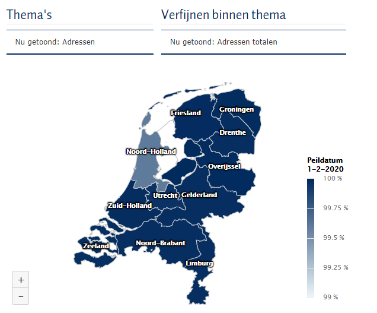

# {{ page.title }}

De kwaliteit van de BAG is een belangrijke voorwaarde voor het gebruik ervan. Om bronhouders te ondersteunen bij het verbeteren van de kwaliteit en afnemers hier inzicht in te geven, zijn verschillende instrumenten beschikbaar.

Zie ook [BAG Kwaliteitszorg](https://www.kadaster.nl/bag-kwaliteitszorg){:target="_blank" rel="noreferrer"}.

## BAG Kwaliteitsdashboard voor afnemers
Het BAG kwaliteitsdashboard voor afnemers geeft inzicht in fouten en andere opvallende signalen. U kunt per thema een selectie maken. Kunt u een bepaald object of adres niet kunt vinden? Dit betekent dat van dit adres of object bij ons geen fouten of andere opvallende signalen bekend zijn. 
De fouten en signalen die in de kwaliteitsrapporten voorkomen, worden zichtbaar bij de maandelijkse controle op de Landelijke Voorziening BAG (LV-BAG). Gemeenten krijgen deze signalen ook gepresenteerd ter controle en verbetering ervan.

Zoals we nu kunnen meten is de kwaliteit van de gegevens in de Basisregistraties Adressen en Gebouwen (BAG) hoog. Natuurlijk is een goede kwaliteit van de gegevens een belangrijke voorwaarde voor het gebruik ervan. Een goede kwaliteit verbetert de dienstverlening aan burgers. Het kwaliteitsdashboard is door het Kadaster ontwikkeld in opdracht van het bestuur van de BAG (BAG BAO).

[Naar het Kwaliteitsdashboard voor afnemers](https://zakelijk.kadaster.nl/bag-kwaliteitsdashboard-voor-afnemers/over-dit-dashboard){:target="_blank" rel="noreferrer"}.

## BAG Kwaliteitsdashboard voor bronhouders
Het BAG Kwaliteitsdashboard voor bronhouders geeft per gemeente inzicht in de kwaliteit van de gegevens van de BAG. Toegang tot het BAG Kwaliteitsdashboard gaat via ['Mijn Kadaster'](https://mijn.kadaster.nl/security/login){:target="_blank" rel="noreferrer"}. Hoe het kwaliteitsdashboard werkt en hoe de gegevens van de rapportages tot stand komen, leest u in de [BAG Toelichting Kwaliteitsdashboard](https://imbag.github.io/praktijkhandleiding/kwaliteitsdashboard.html){:target="_blank" rel="noreferrer"}. 

<u>Optimaliseren Kwaliteitsdashboard</u>
  Uw opmerkingen over de werking van het dashboard of suggesties voor aanvullende rapportages zijn zeer welkom. Dit stelt ons in staat om het BAG Kwaliteitsdashboard voor bronhouders te verbeteren. Wilt u iets verbeteren of hebt u een verzoek, neem dan contact op met de [Klantenservice BAG](https://zakelijk.kadaster.nl/klantenservice-bag){:target="_blank" rel="noreferrer"}. }.
