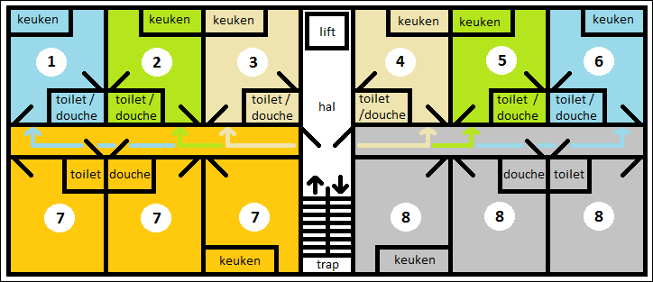

# Studentencomplex

Voor studentencomplexen geldt een specifieke regel als het gaat om de ontsluiting van de verblijfsobjecten via een gedeelde verkeersruimte dat onderdeel is van een ander verblijfsobject:

> _Een deel van een verblijfsobject kan tegelijkertijd dienen als ontsluiting voor andere verblijfsobjecten._

Bij een studentencomplex gaat het over het algemeen over een of meerdere gebouwen, met meerdere woonlagen. Deze zijn speciaal gebouwd voor (en ingericht op) studenten. Vaak leven hier op een gang of afdeling een aantal studenten samen. Het is mogelijk dat complexen met meerdere gangen, die oorspronkelijk niet specifiek voor studenten gebouwd werden, later alsnog speciaal zijn aangepast voor bewoning door studenten.

Het is onwaarschijnlijk om te spreken van een studentencomplex bij bijvoorbeeld de verbouwing van een particuliere woning naar een studentenhuis. In geval van twijfel of het complex wel bedoeld is voor bewoning door studenten geldt de specifieke regel niet. 

----

#### Voorbeeld

Hieronder volgt de afbakening van een voorbeeldsituatie van een studentencomplex, waarbij een deel van een verblijfsobject dient voor de ontsluiting van andere verblijfsobjecten.

 
Volgens de beslisboom voor verblijfsobjecten is de afbakening dan als volgt:

1. Eenheid van functioneel zelfstandig gebruik die het gebruiksdoel wonen mogelijk maakt. De bovenste wooneenheden hebben elk exclusief de beschikking over de vereiste basisvoorzieningen voor het gebruiksdoel wonen. Daarom kunnen ze ieder een verblijfsobject vormen. De onderste 3 kamers aan weerszijden van het trappenhuis delen deze voorzieningen. Daarom vormen deze 3 kamers samen één verblijfsobject.

2. Afsluitbaarheid. De twee gedeeltes links en rechts van het trappenhuis zijn door het trappenhuis gescheiden en kunnen afgesloten worden door een deur. Daarom behoren de gedeeltes links en rechts van het trappenhuis niet tot hetzelfde verblijfsobject. Binnen die twee gedeeltes zijn de deuren van de verschillende wooneenheden afsluitbaar.

3. Toegang tot een gedeelde verkeersruimte. Het trappenhuis zien we als gedeelde verkeersruimte. In dit voorbeeld is er sprake van een 'collectieve ingang' via het trappenhuis. Deze ingang dient als voordeur voor verblijfsobjecten 7 en 8. De bewoners van eenheden 1, 2 en 3 en 4, 5 en 6 hebben elk een eigen voordeur. De gangen van de twee gedeeltes hebben twee functies:

    - gedeelde verkeersruimte voor verblijfsobjecten 1, 2, 3, 4, 5 en 6.
    - onderdeel van de verblijfsobjecten 7 en 8 (dit kan in dit geval vanwege de specifieke regel die geldt voor studentencomplexen).

4. Onderwerp van goederenrechtelijke rechtshandelingen. Voor de goederenrechtelijke rechtshandeling geldt dat dit criterium is opgenomen om te voorkomen dat bijvoorbeeld hotelkamers en cellen als VBO worden afgebakend. Dit is een toets of de eenheid ook juridisch, als een 'goed', op zichzelf zou kunnen staan (vatbaarheid voor goederenrechtelijke rechtshandelingen). Dit criterium staat hier niet in de weg voor de afbakening.
