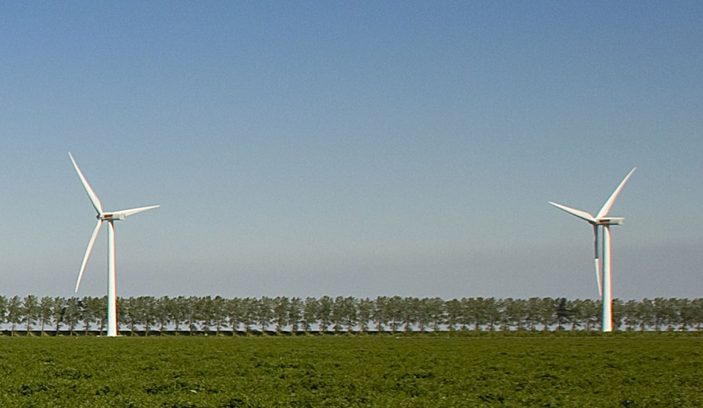

# {{ page.title }}

Met ingang van 1 juli 2018 vervalt de uitzondering voor een windturbine om deze af te bakenen als pand en verblijfsobject.
Dit betekent dat een windturbine moet worden afgebakend als pand en verblijfsobject, indien er wordt voldaan aan de afbakeningscriteria.

Zie hiervoor ook het [Implementatieadvies in het Kwaliteit- en toezichtkader BAG 2020]({{-site.baseurl-}}/beleidskaders/kwaliteit-en-toezichtkader-bag-2020#implementatieadvies)
