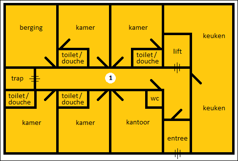
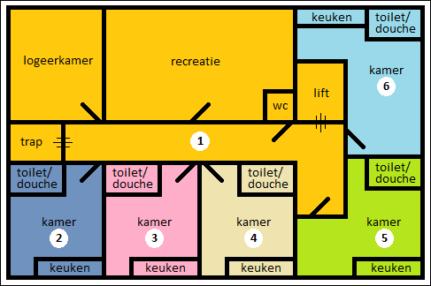

# {{ page.title }}

Voor zorgcomplexen geldt een specifieke regel als het gaat om de ontsluiting van de verblijfsobjecten via een gedeelde verkeersruimte dat onderdeel is van een ander verblijfsobject.

In de [Catalogus BAG 2018]({{-site.baseurl-}}/beleidskaders/catalogus-bag-2018 "Catalogus BAG 2018") is hierover het volgende opgenomen:

>Het kan zijn dat een gedeelte van het complex per kamer zal worden afgebakend, terwijl een ander deel één
verblijfsobject vormt, dat dan bestaat uit bijvoorbeeld een bijeenkomstruimte, verpleegkamers, keuken en
dergelijke. Daarbij kan zich de situatie voordoen dat de hal en gang van het grote verblijfsobject ook dienen
ter ontsluiting van de los afgebakende kamers.

## Toelichting:
1. Er wordt niet gekeken naar het type bewoning in het zorgcomplex maar naar bouwkundige kenmerken.
2. Het criterium "onderwerp van goederenrechtelijke rechtshandeling" wordt standaard met “Ja” beantwoord.
3. Voor de zorgcomplexen worden de normale afbakeningsregels voor verblijfsobjecten toegepast, zoals dat bijvoorbeeld ook voor aanleunwoningen geldt.
4. Als criterium voor functionele zelfstandigheid bij een woonfunctie moet worden gekeken naar de aanwezigheid van minimaal vereiste basisvoorzieningen (in dit geval een eigen keuken, douche en toilet). Het verblijfsobject wordt dus afgebakend tot die kleinste eenheid waarin zich deze voorzieningen bevinden. Vaak is het in een zorgcomplex overigens juist niet de bedoeling dat er zelfstandig gekookt wordt op de kamers. Over het algemeen worden de maaltijden in een centrale keuken bereid. Als er twijfel is over de mogelijkheid om te kunnen koken op kamers in een zorgcomplex, dan kan de aanwezigheid van een centrale keuken daarmee een belangrijke aanwijzing zijn dat het niet de bedoeling is dat er op de kamers gekookt wordt. 
5. Nadat deze verblijfsobjecten zijn afgebakend blijven onderdelen over als bijvoorbeeld de praktijk- en behandelruimtes en gezamenlijke ruimten. Ook het afbakenen hiervan gebeurt volgens de geldende afbakeningsregels. In de praktijk zal dit resterende deel leiden tot 1 of een beperkt aantal verblijfsobjecten.
6. Een verpleeghuis of verpleegafdeling in een verzorgingshuis is niet nader onder te verdelen in functioneel zelfstandige eenheden als de kamers daar niet over de minimaal vereiste basisvoorzieningen beschikken.

### Voorbeeld

----

Hieronder volgt de afbakening van een voorbeeldsituatie van een zorgcomplex (met twee woonlagen), waarbij een deel van een verblijfsobject dient voor de ontsluiting van andere verblijfsobjecten.

#### Begane grond:

#### 1e verdieping:

Volgens de beslisboom voor verblijfsobjecten is de afbakening dan als volgt:

1. Eenheid van functioneel zelfstandig gebruik die het gebruiksdoel wonen mogelijk maakt. De kamers (2, 3, 4, 5 en 6) op de 1e verdieping hebben elk exclusief de beschikking over de vereiste basisvoorzieningen voor het gebruiksdoel wonen. Deze kunnen daarmee ieder een verblijfsobject vormen. Alle overige ruimten in het zorgcomplex delen de voorzieningen op de beide verdiepingen, daarom vormen deze overige ruimten (inclusief de trap, de lift en de entree) gezamenlijk één verblijfsobject (aangeduid met 1).

2. Afsluitbaarheid. De deuren van de verschillende ruimten zijn afsluitbaar.

3. Toegang tot een gedeelde verkeersruimte. De deur van de entree op de begane grond dient als voordeur voor verblijfsobject 1. De gang op beide verdiepingen dient als gedeelde verkeersruimte voor de ontsluiting van de kamers op de 1e verdieping (2, 3, 4, 5 en 6). De gangen van de begane grond en de 1e verdieping hebben daarmee twee functies:
a. gedeelde verkeersruimte voor verblijfsobjecten 2, 3, 4, 5 en 6.
b. onderdeel van verblijfsobject 1 (dit mag in dit geval vanwege de specifieke regel die geldt voor een zorgcomplex).

4. Onderwerp van goederenrechtelijke rechtshandelingen. Voor de goederenrechtelijke rechtshandeling
geldt dat dit criterium is opgenomen om te voorkomen dat bijvoorbeeld hotelkamers en cellen als VBO
worden afgebakend. Dit is een toets of de eenheid ook juridisch, als een ‘goed’, op zichzelf zou kunnen
staan (vatbaarheid voor goederenrechtelijke rechtshandelingen). Dit criterium staat hier niet in de weg
voor de afbakening.
